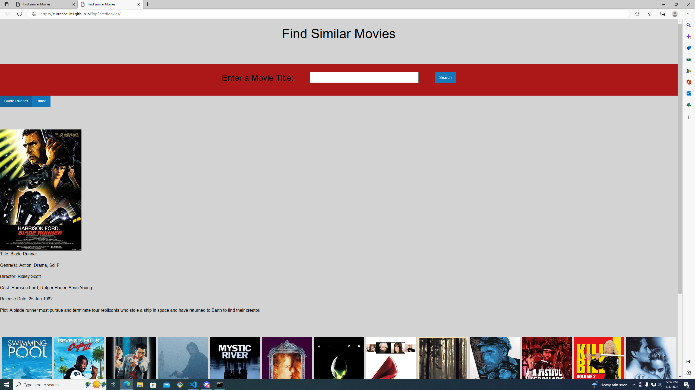

# Find Similar Movies

As a movie watcher I want to create a search page so that:
When I search a title of a movie, then information about that movie is displayed
When I look below the searched movie
Then a list of similar movies is also shown
When I click on any of the similar movies
Then a modal pops up with its description
When I click on the buttons for previously searched movies using local storage
Then I access that search page result again
When I search for a movie that does not exist
Then a message displays informing me the movie cannot be found

## Description

We were assigned a project to make a webpage that utilizes two different APIs, local storage, and interactivity.
We made a webpage where if you search a movie it will pull up the poster and info for that movie and from there it takes info from the searched movie and gives you movies similar to what you searched. When you search a movie a button is saved under the search bar for the movie that you searched and when clicked it takes you to the page for that movie and includes the similar movies. I learned that sometimes you will have to move things around in the code in order for you to get them to work as needed. I also learned that foundation makes styling much simpler and that modals modals are a good way to have info pop up instead of using an alert.

## Installation

In order to get this webpage running we needed to link jquerey, foundation, and our APIs in our code. In order to get our Apis, we had to apply for a key from OMDB and TheMovieDB, without these our webpage wouldn't be possible.

## Usage

When you search a movie on the webpage that movies poster will pop up with the info for that movie and underneath that info 20 movies similar to that movie will appear. A button linking to the search will be created apon searching. each of the posters for the similar movies is also a clickable modal and it will pop up a description of the move when clicked on.

active webpage link:
https://currancollins.github.io/TopRatedMovies/

## Credits

Gene Kim
Curran Collins
Johann Kubeja

## License

N/A
